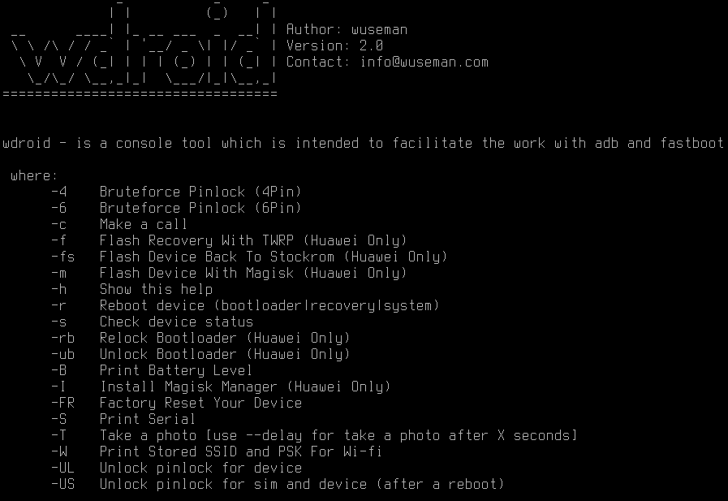

# WDROID

#### README

wdroid is a console tool which is intended to facilitatethe work of adb and fastboot for android devices.

wdroid is especially developed for Huawei devices

#### Example:

#### REQUIREMENTS

A linux setup would be good with android-tools(adb/fastboot) ;)

#### CONTACT 

If you have problems, questions, ideas or suggestions please contact
us by posting to info@sendit.nu

#### WEB SITE

Visit our homepage for the latest info and updated tools

https://github.com/wuseman

#### END!
