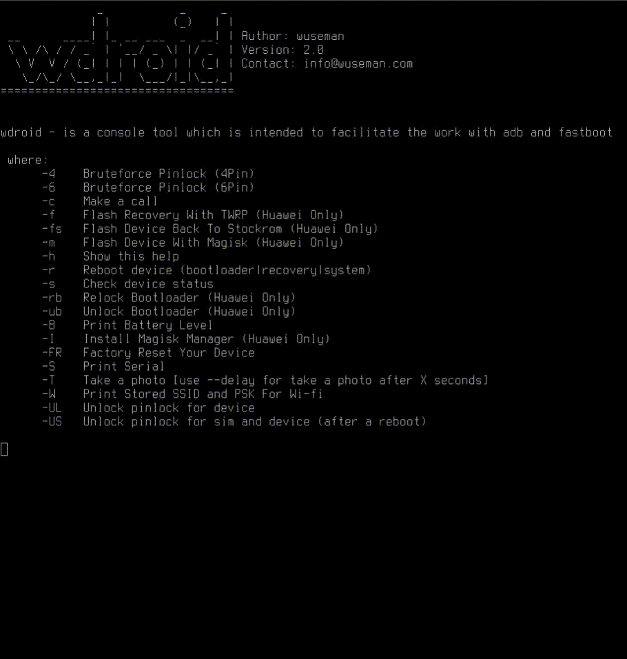

# WDROID

#### README

wdroid is a console tool which is intended to facilitatethe work of adb and fastboot for android devices.

#### Examples of usage:

##### Make a call

##### Restore device to stockrom via flashing:

##### Flash Ramdisk on HUAWEI devices with TWRP: 

##### Unlock access to bootloader:

##### Unlock bootloader:

##### Flash device with magisk and get ROOT:

### Other features:
##### Uninstall bloatware
##### Make A Call
##### Text A Message
##### Read All SMS Stored On Device
##### Delete All SMS Stored On Device
##### Unlock Pin And Sim Without Touching Phone
##### Print Stored Wi-Fi Data
##### Bruteforce Pinlock
##### And Alot More.
##### Turn FLashlight On
##### Take A Photo - (Delays Possible)
##### And Alot More! Stay tuned.

#### REQUIREMENTS

A linux setup would be good with android-tools(adb/fastboot) ;)

#### CONTACT 

If you have problems, questions, ideas or suggestions please contact
us by posting to info@sendit.nu

#### WEB SITE

Visit our homepage for the latest info and updated tools

https://github.com/wuseman

#### END!
